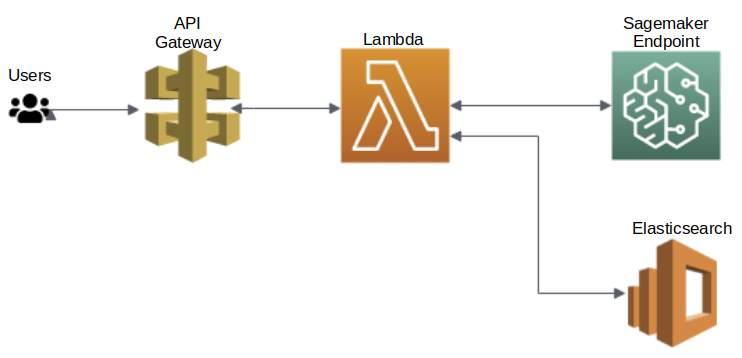

# Content Based Image Retrieval
This repository contains the code necessary to perform content based image retrieval. 
The process is first tested locally in Local_testing.ipynb, then scaled up by using AWS services. 

The main procedure is as follows: 
1. Build a feature extraction model
2. Infer on all the images in the set and store the features
3. Load the features into OpenSearch (ElasticSearch) 
4. Build an inference endpoint using Amazon Sagemaker
5. Build a Lambda function to perform inference and KNN search given an input image
6. Setup a REST API using API Gateway to manage accesssing the lambda function

From here, the user can make a request to the api with a base64 encoded image and a value for K, the number of requested similar images. 

#### Deployment Architecture

## UI Example
As a minimal viable product, a simple frontend is used here to manage the query image selection, rest api request, and result visualizaiton. Users can also define their own frontends and link to the AWS rest endpoint. 

  

  

## Approaches

Three similar approaches were used for feature extraction. The first and simplest approach uses an imagenet pretrained ResNet50 as a feature extractor. This method alone works very well with minimal setup, returning embedding vectors of size 2048. 
The second approach again uses an imagenet pretrained ResNet50, but it extends this base model by adding three extra dense layers which reduce the resulting vector down to length 256. The extended network is then trained with image triplets consisting of an anchor sample, a positive sample, and a negative sample. The training procedure tries to minimize the separation between the anchor and postive samples while maximizing the anchor to negative sample distance. 
The final approach is a two step process. First, a classifier network is trained to classify incoming images into one of the possible classes. Then, search is conducted only on the features within that class. For this approach, two classifiers was trained and tested. See the figure below for their per class performance.

    
KNN Classifier

    

    
SVM Classifier

    

Various experiments were conductec with these three approaches to maximize the accuracy metric which tests the class of the retrieved image against the class of the query image. These experiments varied the feature extractor used, the use of feature scaling, the use of Principle Component Analysis (PCA) as a dimensionality reduction technique, as well as some augmentation techniques. The best results will be discussed in the next section. For a full list of all experiments, see the [Experiments] (#experiments) section.

## Model Comparison
There are two main factors to take into account when evaluating model perfomrnace:

1. Model accuracy
2. Speed

High accuracy will allow us to choose the best image for a given query, while low runtime will lead to better user experience as it will minimize the time required for users to get their results back. Hence, together these two metrics will dictate customer satisfaction. 
#### Model Performance
For the models described in the previous section, the accuracy for values of K ranging from 1-10 is as shown in the following figure. The result show that for the single step process, accuracy decreases as K is increased. While for the two step model, accuracy is pinned at the classifier accuracy. This is as expected since our metric of accuracy in this problem is whether the class of the predicted image matches the class of our query image.

&nbsp; | ResNet50   2048 | ResNet50 Triplet   256 | SVM + ResNet50   2048 
--- | --- | --- | --- |--- 
1 | 0.938 | 0.936 | 0.951 |
2 | 0.923 | 0.935 | 0.951 |
3 | 0.914 | 0.932 | 0.951 |
4 | 0.896 | 0.931 | 0.951 |
5 | 0.896 | 0.928 | 0.951 |
6 | 0.886 | 0.928 | 0.951 |
7 | 0.884 | 0.926 | 0.951 |
8 | 0.88  | 0.928 | 0.951 |
9 | 0.878 | 0.928 | 0.951 |
10 | 0.87 | 0.924 | 0.951 |

#### Time Complexity
Looking at runtime for the different models, we can that minimizing the search space reduces the runtime of the process. This can also be seen in the PCA number of components anlysis in the next table. 

| ResNet50   2048 | ResNet50 Triplet   256 | SVM + ResNet50   2048 
| --- | --- | --- |--- 
0.04 | 0.226 | 0.119

## Experiments
In each listing below, the first line defines the parameter of the experiment, while the second line shows the accuracy measuere with values of k ranging from 1 to 10. 

    Method 1:
        'Resnet50, no scaling, feat_len=2048, samples-5999, took: 0.164'
        [0.90, 0.88, 0.864, 0.854, 0.855, 0.847, 0.846, 0.839, 0.84, 0.84, 0.84]

        'Resnet50, no scaling, pca, feat_len=1000, samples-5999, took: 0.08'
        [0.902, 0.882, 0.864, 0.854, 0.856, 0.847, 0.841, 0.843, 0.842, 0.838, 0.842]

        'Resnet50, no scaling, pca, feat_len=500, samples-5999, took: 0.04'
        [0.901,0.883,0.869,0.852, 0.855,0.85,0.842, 0.844, 0.844,  0.837, 0.839]

        'Resnet50, no scaling, pca, feat_len=100, samples-5999, took: 0.017'
        [0.9, 0.874, 0.867, 0.858, 0.845, 0.850, 0.846, 0.844, 0.84, 0.842, 0.835]

        'Resnet50, minmax scaling, feat_len=2048, samples-5999, took: 0.165'
        [0.899, 0.876, 0.86, 0.861, 0.853, 0.844, 0.843, 0.834, 0.841, 0.836, 0.833]

        'Resnet50, minmax scaling, pca, feat_len=1000, samples-5999, took: 0.08'
        [0.9, 0.873, 0.86, 0.863, 0.854, 0.847, 0.845, 0.838, 0.842, 0.835, 0.835] 

        'Resnet50, minmax scaling, pca, feat_len=100, samples-5999, took: 0.017'
        [0.892, 0.871, 0.867, 0.86, 0.853, 0.848, 0.846, 0.84, 0.834, 0.833, 0.836] 

        'Resnet50, minmax scaling, pca, feat_len=50, samples-5999, took: 0.014'
        [0.887, 0.868, 0.866, 0.854, 0.848, 0.842, 0.839, 0.834, 0.834, 0.83, 0.835] 

        'Resnet50, minmax scaling, pca, feat_len=10, samples-5999, took: 0.012'
        [0.831, 0.821, 0.818, 0.801, 0.795, 0.802, 0.796, 0.788, 0.784, 0.787, 0.794] 

        'Resnet50, minmax scaling, pca, feat_len=2, samples-5999, took: 0.011'
        [0.462, 0.464, 0.461, 0.464, 0.456, 0.457, 0.463, 0.468, 0.459, 0.459, 0.454] 

        'Resnet50, Standard scaling, feat_len=2048, samples-5999, took: 0.162'
        [0.89, 0.868, 0.852, 0.848, 0.845, 0.842, 0.83, 0.832, 0.828, 0.829, 0.823] 

        'Resnet101, no scaling, pca, feat_len=1000, samples=5999, took: 0.087'
        [0.874, 0.857, 0.839, 0.835, 0.825, 0.822, 0.814, 0.808, 0.806, 0.801, 0.796] 

        'resnet18, no scaling, feat_len=512, samples=5999, took: 0.035'
        [0.89, 0.868, 0.856, 0.851, 0.84, 0.831, 0.829, 0.822, 0.826, 0.816, 0.813] 

        'resnet18: noscaling,  feat_len=512, samples=5999, Rotation augmentation, took: 0.04'
        [0.938, 0.923, 0.914, 0.896, 0.896, 0.886, 0.884, 0.88, 0.878, 0.87, 0.869] 

        'resnet18, no scaling, feat_len=512, samples=5999, test time aug, took: 0.106'
        [0.887, 0.866, 0.853, 0.846, 0.842, 0.833, 0.83, 0.83, 0.826, 0.828, 0.816] 

        'resnet50, no scaling, feat_len=2048, samples=5999, test time aug took: 0.457'
        [0.896, 0.873, 0.861, 0.859, 0.855, 0.842, 0.847, 0.846, 0.84, 0.836, 0.837] 

    # Method 2
        'ResNet50 Triplet, feat_len=256, margin = 10, samples=5999, took: 0.1'
        [0.898,0.890,0.89,0.888,0.888,0.896,0.892,0.882, 0.893, 0.89]

        'ResNet50 Triplet, feat_len=256, margin = 0.5, samples=5999, took:  0.096'
        [0.911,0.906,0.906,0.9,0.902,0.906,0.903,0.9, 0.904,0.905]

        'ResNet50 Triplet, feat_len=256, margin=0.5, samples=5999, rotation augmentation, took:  0.226'
        [0.9357,0.935,0.932,0.931,0.9283,0.928,0.926,0.9275,0.928, 0.924]

    # Method 3
        'KNN + ResNet50, feat_len=2048, no scaling, samples=5999, took:0.0245'
        [0.936, 0.936, 0.936, 0.936, 0.936, 0.936, 0.936, 0.936, 0.936, 0.936]

        'SVM + ResNet50, feat_len=2048, no scaling, samples=5999, rotation augmented KNN, took:0.119
        [0.951, 0.951, 0.951, 0.951, 0.951, 0.951, 0.951, 0.951, 0.951, 0.951] 